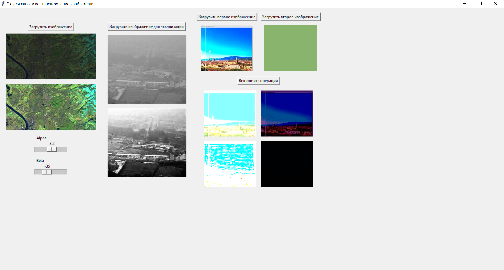

# Приложение для контрастирования и эквализации гистограммы изображений

Это приложение позволяет пользователям выполнять линейное растяжение контраста и эквализацию гистограммы изображений с использованием Python, OpenCV и Tkinter. Пользователи могут загружать изображения, настраивать параметры  и просматривать результаты в интерактивном режиме.

## Возможности

- **Загрузка изображений**: Пользователи могут загружать изображения для контрастирования и эквализации гистограммы.
- **Линейное контрастирование**: Применяйте линейное контрастирование, используйте ползунки для изменения парметров алгоритма.
- **Эквализация гистограммы**: Применяйте эквализацию гистограммы для улучшения контраста изображений.
- **Арифметические операции**: Выполняйте сложение, вычитание, умножение и деление для двух загруженных изображений.
- **Отображение результатов**: Отображаются оригинальные и обработанные изображения рядом друг с другом.

## Требования

Для запуска этого приложения необходимо установить следующие пакеты:

- Python (версии 3.6 или выше)
- OpenCV
- NumPy
- Tkinter
- Pillow

## Пример

1. Загрузите изображение для применения линейного  контрастирования.
2. Настройте ползунки, чтобы увидеть изменения в реальном времени.
3. Загрузите изображение для эквализации гистограммы, чтобы увидить результат.
4. Загрузите два изображения, чтобы выполнить арифметические операции и просмотреть результаты.

